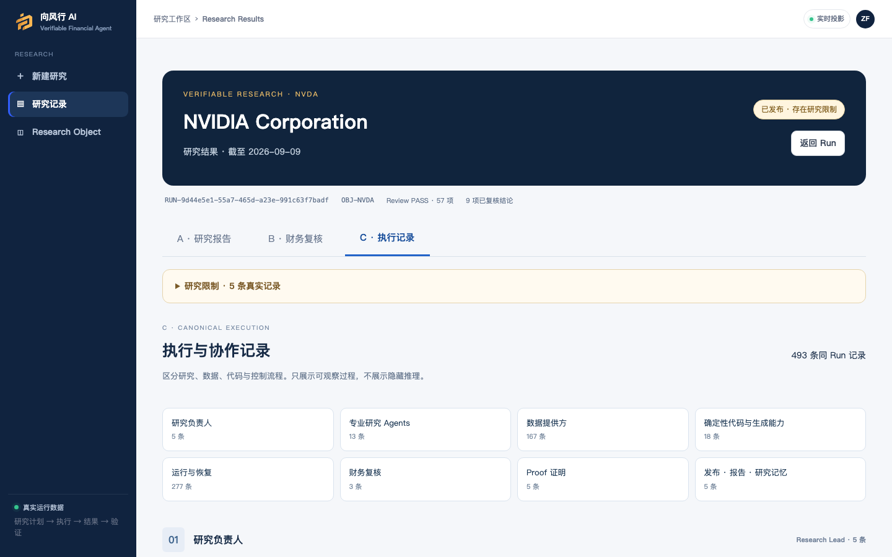

# External Evaluation Snapshot · 2026-09-09

Canonical bilingual evaluation documents: [English](docs/evaluation/EVALUATION_README.md) · [简体中文](docs/evaluation/EVALUATION_README.zh-CN.md).

This snapshot is a truthful, runnable Alpha evaluation boundary, not a production-security or investment-performance certification.

本快照是可运行、如实披露边界的 Alpha 外部评估版本，不代表生产级安全认证，也不构成投资建议或收益保证。

Latest investor-equivalent validation: GitHub `v3` downloaded, unpacked, credential placed, installed and doctor-ready with exact revision/digest; its single NVDA Run `RUN-305a06c7-642d-42ed-8109-1a93b320aa48` terminated `FAILED / REQUIRED_CALCULATION_UNAVAILABLE`. See the canonical bilingual documents for the preserved baseline success and latest failure truth.

## Accepted local evidence / 已验收本地证据

- Source candidate: `bcd3525a0e4a194f37775477027d988ed224bb6e`.
- Immutable runtime image: `sha256:c45e2c1cf6cd2a0095be4b05cb14eaeaca28c0e7b9c952fbf919ff975455a451`.
- `vfa doctor`: Database, Backend, Frontend, RISC Zero 3.0.6 Proof Runtime, governed Sandbox Runtime and Direct Registry all READY; API and Broker revision/digest matched the candidate.
- One fresh, isolated NVDA Live Run: `RUN-9d44e5e1-55a7-465d-a23e-991c63f7badf`, terminal `RELEASED / SUCCESS`, sequence 261.
- `report_synthesis`: Sol failed unavailable; Luna capability check timed out; Terra capability check was unavailable; the prospectively authorized MiMo `mimo-v2.5` fallback succeeded. Checks and actual calls retained separate accounting.
- Offline gate: 1,579 backend tests passed, 11 skipped; frontend build and scripted checks passed; focused installer/recovery/projection tests passed; Ruff, shell syntax, diff and public secret scan passed.

## Evaluation setup / 评估方式

Use the release archive and the Owner-supplied encrypted `VFA-Investor-Access.vfacred`. Copy it to `credentials/active.vfacred`, run the platform installer, then use `vfa start` and `vfa doctor`. The credential bundle and passphrase are never published in GitHub.

The supported direct scope is four FMP keys, Bocha Web Search only, MiMo `mimo-v2.5`, and TeamoRouter `gpt-5.6-sol`, `gpt-5.6-luna`, `gpt-5.6-terra`. Configuration is not a promise that every upstream call will be available.

## Current limitations / 当前限制

- The accepted Live released a result despite two specialist tasks retaining truthful failures; the product surfaced five research limitations. A released result must be read with those limitations and its Financial Review evidence.
- Report source/contribution coverage remains partial; a complete Claim Trace drawer and PDF export are not implemented.
- Provider availability, quota and latency remain external dependencies. Recovery is bounded and may still terminate with a known issue.
- RISC Zero proofs cover defined deterministic computations, not every narrative claim, model reasoning, or investment suitability.
- The governed Broker isolates supported generated-capability execution; this is not a general-purpose arbitrary-code sandbox.
- The current acceptance is macOS/Docker local evidence. Windows clean-machine E2E remains unverified.
- The optional Owner gateway is not deployed. Direct encrypted credentials and native BYOK do not require it.
- This is Controlled Alpha software without public SaaS tenancy, Auth/RBAC/SSO, or enterprise support guarantees.

## Visual evidence / 界面证据

The image is an unretouched 1440 × 900 capture of the real local React runtime and persisted Run above. Historical product screenshots and their provenance remain in [docs/product/screenshots/PROVENANCE.md](docs/product/screenshots/PROVENANCE.md).

## Next exact action

`PHASE6A_POLICY_AND_RECOVERY_AUDIT` — not started in this snapshot.
