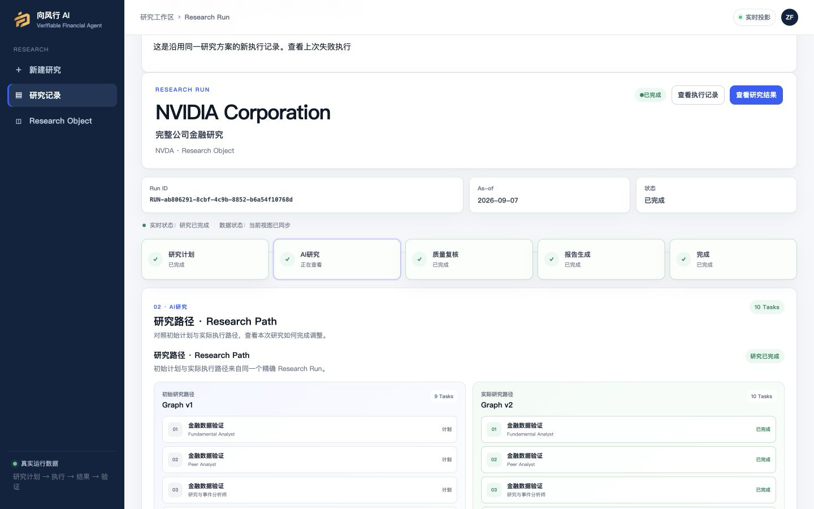
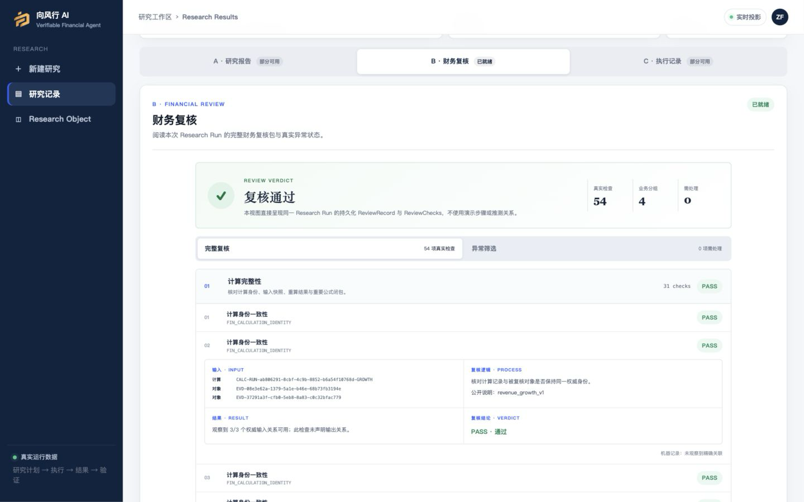
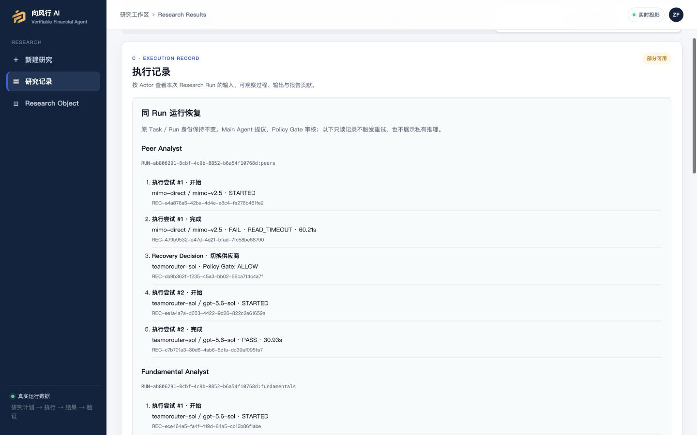
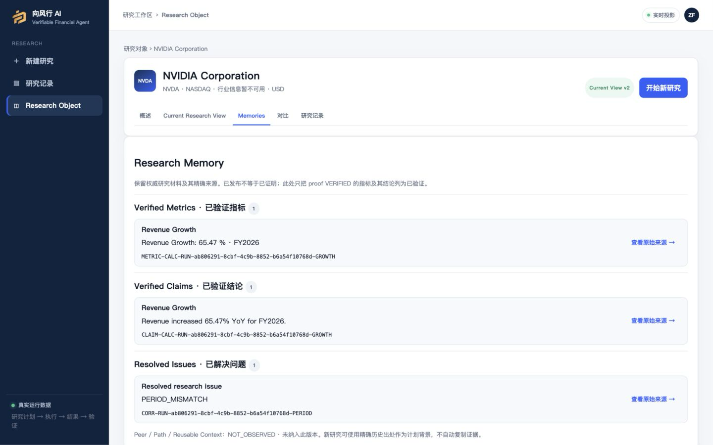
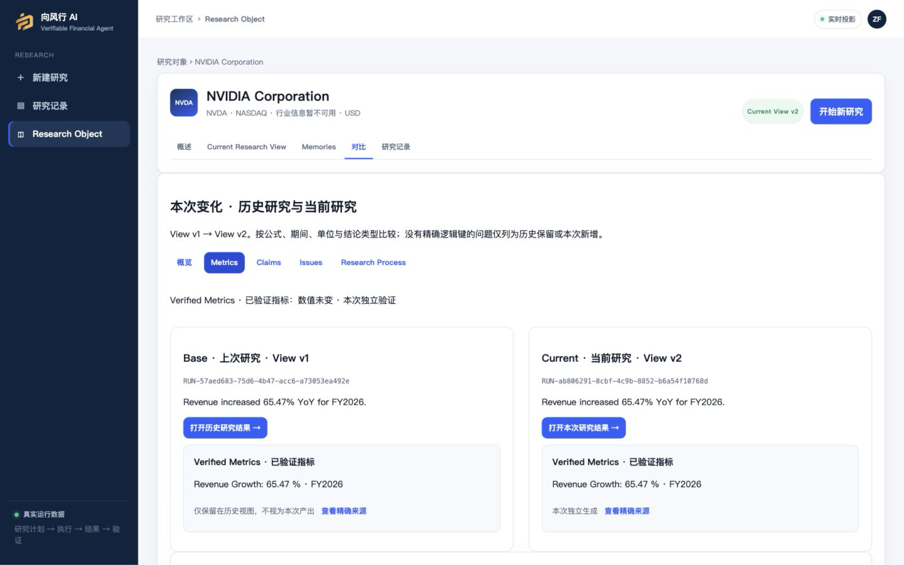

# Verifiable Financial Agent

向风行 AI：能够自主执行、验证、恢复、记忆并持续积累的金融研究 Agent。

Local Deployable Alpha · Controlled Alpha Ready

多 Agent 研究 · 可验证结果 · 自适应恢复 · 研究记忆

[English](README.md) · [评估 / 本地运行](docs/deployment/EVALUATOR_QUICKSTART.md) · [产品导览](docs/product/PRODUCT_WALKTHROUGH.md)

## 能用 · Make It Useful

用户提出研究目标，Agent 负责组织和执行研究。

Research Object → Research Goal → AI Research Scheme → Research Lead + Specialist Agents → Dynamic Research Path → Financial Research Result。

先审阅并确认研究方案，再观察专家协作、任务内纠错与受控重规划，而不是只收到一段生成文字。

## 敢用 · Make It Trustworthy

在已支持的范围内，检查：Claim → Evidence → Calculation → Financial Review → Proof → Execution Record。

确定性计算、独立财务复核、有限范围的必需证明与精确执行身份，让研究结果可检查。证明只覆盖明确计算，不证明每句文字都正确，也不保证投资适用性。

Provider / Model Failure → Recovery Decision → Policy Gate → Same-Run Recovery。

恢复受预算和策略约束，有公开可观察的记录。Report ↔ Execution 仅使用已持久化的精确映射；来源和贡献覆盖仍为 **PARTIAL**，完整 Claim Trace drawer 尚不可用。

## 越用越好 · Make It Better With Use

以下研究记忆闭环已经实现，不是路线图：

已发布研究 → Research Memory → 增量研究 → 更新 / 重新验证 / 避免重复问题 → 新的已发布研究 → Memory v2 → Base vs Current。

历史帮助决定哪些材料需更新、哪些结论需独立重验、哪些问题不应重复。新的研究不继承上次批准。这是研究资产积累，不是模型训练，也不承诺投资收益自动改善。

## Real Product Screenshots · 真实产品截图

当前本地 React 产品、真实持久化研究与已验收的橙色 Logo；不是原型或生成的效果图。

### 自主研究

### 财务复核

### 自适应恢复

### 研究记忆

### 历史与当前对比

[截图来源与能力边界](docs/product/screenshots/PROVENANCE.md)。截图反映历史验收结果，不保证每次新调用都成功。

## What Works Today · 当前可用能力

- Research Object、研究目标、模型生成 Scheme、确认后创建 Run。
- Research Lead 与专家 Agent、动态任务图、Self-Correction 与受控 Replan。
- 同一个 Run 内的有限 provider/model 恢复。
- 真实财务数据、确定性计算、财务复核与有限范围的必需 Proof。
- 财务报告及已映射部分的 Report ↔ Execution 追踪。
- Research Memory v2、Incremental Research、Base vs Current。
- PostgreSQL 持久化和真实 React/TypeScript 界面。

[能力状态](docs/product/PRODUCT_STATUS.md)明确区分可用、部分可用和未实现。

## Adaptive Runtime · 自适应运行时

系统基于自有错误分类提出恢复决策，独立策略检查身份、路由权限、能力证据和剩余预算，再允许下一次调用。恢复不会重生成 Scheme、更换知识基线或悄悄新建 Run。

注册路由仅包括 `teamorouter-sol`、`teamorouter-luna`、`mimo-direct`。[运行时架构与预算](docs/architecture/ADAPTIVE_RUNTIME.md)。

## Evaluate / Run Locally · 评估与本地运行

投资人和平台评估者默认使用 **Evaluator 模式**：安装依赖、配置自己的 PostgreSQL、打开 Owner 私下签发的加密 `.vfaeval` 文件、交互输入口令，再启动前端。启动器自动检查网关授权，不调用收费上游。评估者机器不需要也不应接收 FMP、TeamoRouter 或 MiMo 密钥。

直接阅读[评估者快速开始](docs/deployment/EVALUATOR_QUICKSTART.md)、[本地部署说明](docs/deployment/LOCAL_DEPLOYMENT.md)和[安全环境变量模板](.env.example)。

参见 [macOS](docs/deployment/MACOS_EVALUATION.md) 和 [Windows / WSL2](docs/deployment/WINDOWS_EVALUATION.md) 指引。需要 Python 3.11、Node.js 24、PostgreSQL；完整必需证明需要 RISC Zero，生成能力验证需要 Docker。Windows 完整评估推荐 WSL2，不宣称原生证明工具链等价。

网关基础能力已实现并完成离线测试；本次任务没有部署真实 Owner 网关（`NOT_DEPLOYED`）。正式使用前须由 Owner 提供已部署网关和评估凭据。配额只是评估保护限制，不是商业积分、订阅或付费权益；实际费用为 `NOT_OBSERVED`，新研究可能产生 Owner 上游费用。

高级用户和独立部署仍可使用 [BYOK](docs/deployment/LOCAL_DEPLOYMENT.md)，明确设置 `VFA_CREDENTIAL_MODE=byok`。[Owner 网关管理](docs/deployment/EVALUATOR_GATEWAY.md) · [凭据安全边界](docs/architecture/EVALUATOR_CREDENTIAL_SECURITY.md)。仓库不包含 Owner 数据库、私有运行产物或凭据。

## Architecture & Validation · 架构与验证

[系统架构](docs/architecture/SYSTEM_ARCHITECTURE.md) · [研究记忆](docs/architecture/RESEARCH_MEMORY.md) · [产品验收](docs/validation/PRODUCT_ACCEPTANCE.md) · [恢复验收](docs/validation/ADAPTIVE_RECOVERY_ACCEPTANCE.md) · [部署验收边界](docs/validation/LOCAL_DEPLOYMENT_ACCEPTANCE.md)。

## Current Status / Roadmap · 状态与路线图

**LOCAL DEPLOYABLE = YES · CONTROLLED ALPHA READY = YES**

Controlled Alpha 指有引导的评估就绪，不代表已验证规模化用户使用。尚不宣称 Public SaaS、企业级安全、Auth/RBAC/SSO、完整来源覆盖或投资建议适用性。

未来：Evaluation → POT → 基于证据的 Provider / Model Selection。完整 Evaluation/POT 尚未实现；研究记忆和增量研究已实现。

[产品状态](docs/product/PRODUCT_STATUS.md) · [许可证待 Owner 决策](docs/LEGAL_AND_LICENSE_STATUS.md)。

## Recognition · 外部里程碑

仓库记录了面向 AIx Origin Summit Hong Kong 的 Flux · 流境提交，作为早期对外展示里程碑。奖项等级及官方赛道名称待权威材料确认，此处不宣称铜奖。

[Recognition 记录](docs/recognition/AIX_ORIGIN_SUMMIT.md)。
