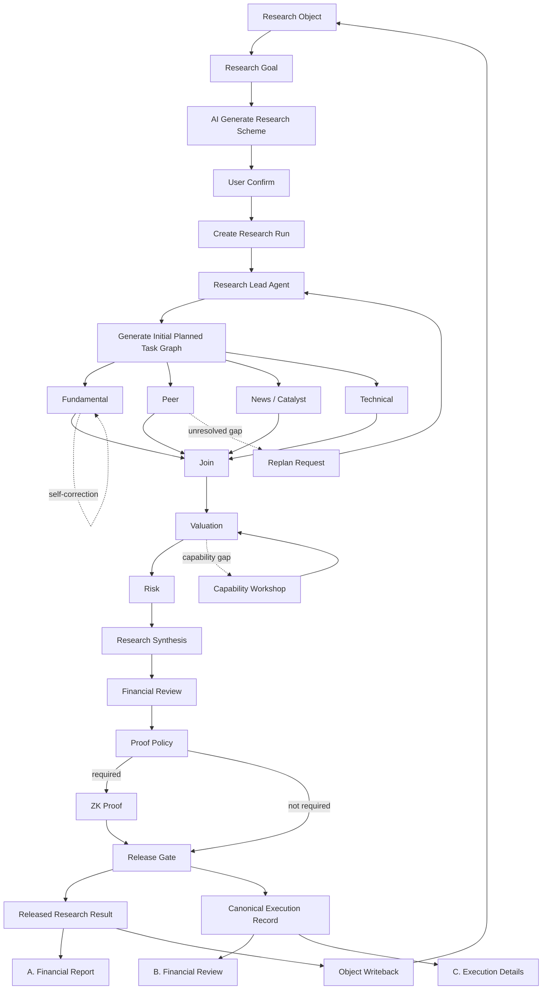

# 01 — Product & Workflow V1

[简体中文](01_PRODUCT_AND_WORKFLOW_V1.zh-CN.md)

## 1. Frontend navigation

MVP 一级入口：

```text
+ 新建任务
任务列表
研究对象
```

Run 页面不是一级导航，通过新建任务或任务列表进入。

## 2. New Task UX

```text
Step 1 选择 / 创建 Research Object
        ↓
Step 2 输入 Research Goal
        ↓
Step 3 AI Generate Research Scheme
        ↓
        用户查看并确认
        ↓
Step 4 Create Research Run
```

Scheme 可包括：

- Scope
- Data requirements
- Expected research modules
- Financial calculations
- Specialist roles
- Assurance requirements
- Report requirements
- Assumptions / limitations

用户当前不管理“方案库”。

## 3. Research Journey



## 4. Task Card

默认只展示：

- Task name
- Business meaning
- Agent role
- Progress
- Evidence / calculation counters
- Current task state

点击后展开：

- Skill steps
- Financial statements
- Calculations
- Evidence
- AI judgment
- Self-correction history
- Technical details (secondary)

## 5. Self-Correction UX

不新增顶级 block：

```text
Fundamental Analysis
↻ Self-correcting
Attempt 2 / 3
Period mismatch → fixing...
```

Detail drawer 才展示 correction history。

## 6. Replan UX

只有 Graph 改变才新增 block：

```text
Peer Analysis
   ↓
Additional Peer Evidence (origin = REPLAN)
   ↓
Peer Resume
```

## 7. Capability Gap UX

MVP：

```text
Capability Gap
Missing: peer-adjusted P/E
[Use fallback] [Generate temporary calculation module]
```

用户确认后：

```text
Code Builder
→ Sandbox
→ Tests
→ Financial Validation
→ TASK_APPROVED
→ Resume original Task
```

## 8. Result UX

A 独立业务输出：

- Financial Report

B/C 同一事实两个视角：

- Financial Review
- Execution Details

B 看金融语义；C 看 Agent / Skill / Tool / Code / Trace / cost。
