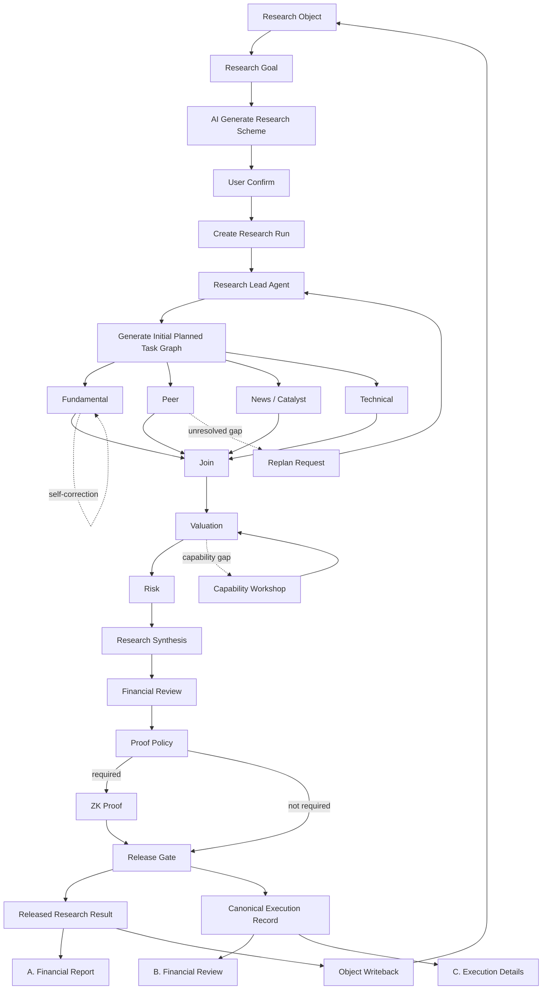

# 01 — 产品与工作流 V1

[English](01_PRODUCT_AND_WORKFLOW_V1.md)

## 1. 前端导航

MVP 一级入口：

```text
+ 新建任务
任务列表
研究对象
```

Run 页面不是一级导航，通过新建任务或任务列表进入。

## 2. 新建任务交互

```text
Step 1 选择 / 创建 Research Object
        ↓
Step 2 输入 Research Goal
        ↓
Step 3 AI Generate Research Scheme
        ↓
        用户查看并确认
        ↓
Step 4 Create Research Run
```

Scheme 可包括：

- 范围
- 数据要求
- 预期研究模块
- 财务计算
- 专业角色
- 保障要求
- 报告要求
- 假设／限制

用户当前不管理“方案库”。

## 3. 研究流程



## 4. 任务卡片

默认只展示：

- 任务名称
- 业务含义
- Agent 角色
- 进度
- 证据／计算计数
- 当前任务状态

点击后展开：

- Skill 步骤
- 财务报表
- 计算
- 证据（Evidence）
- AI 判断
- 自纠历史
- 技术详情（次要）

## 5. 自纠交互

不新增顶级 block：

```text
Fundamental Analysis
↻ Self-correcting
Attempt 2 / 3
Period mismatch → fixing...
```

Detail drawer 才展示 correction history。

## 6. 重新规划交互

只有 Graph 改变才新增 block：

```text
Peer Analysis
   ↓
Additional Peer Evidence (origin = REPLAN)
   ↓
Peer Resume
```

## 7. 能力缺口交互

MVP：

```text
Capability Gap
Missing: peer-adjusted P/E
[Use fallback] [Generate temporary calculation module]
```

用户确认后：

```text
Code Builder
→ Sandbox
→ Tests
→ Financial Validation
→ TASK_APPROVED
→ Resume original Task
```

## 8. 结果交互

A 独立业务输出：

- 财务报告（Financial Report）

B/C 同一事实两个视角：

- 财务审查
- 执行详情（Execution Details）

B 看金融语义；C 看 Agent / Skill / Tool / Code / Trace / cost。
