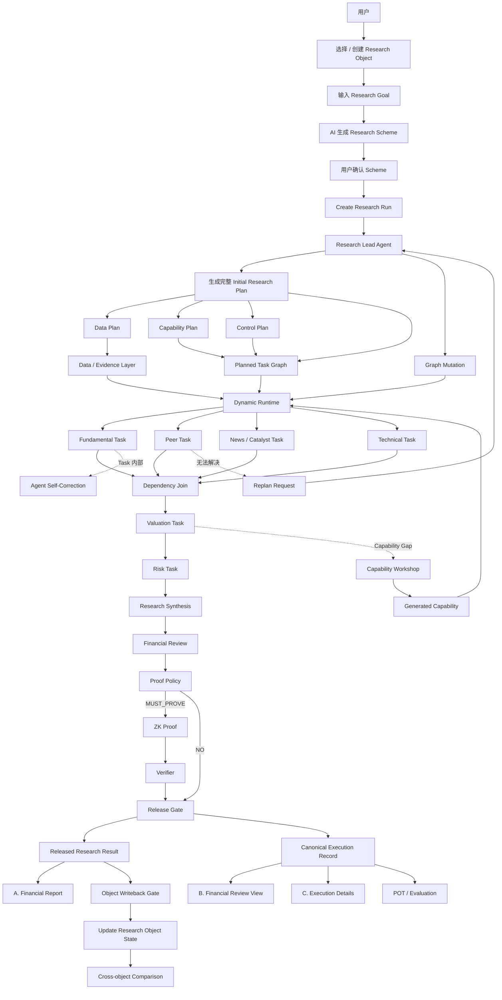
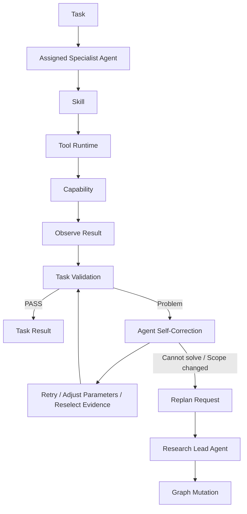
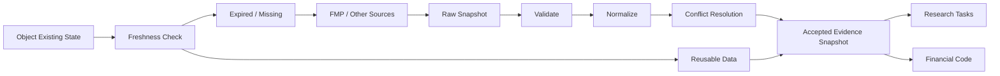
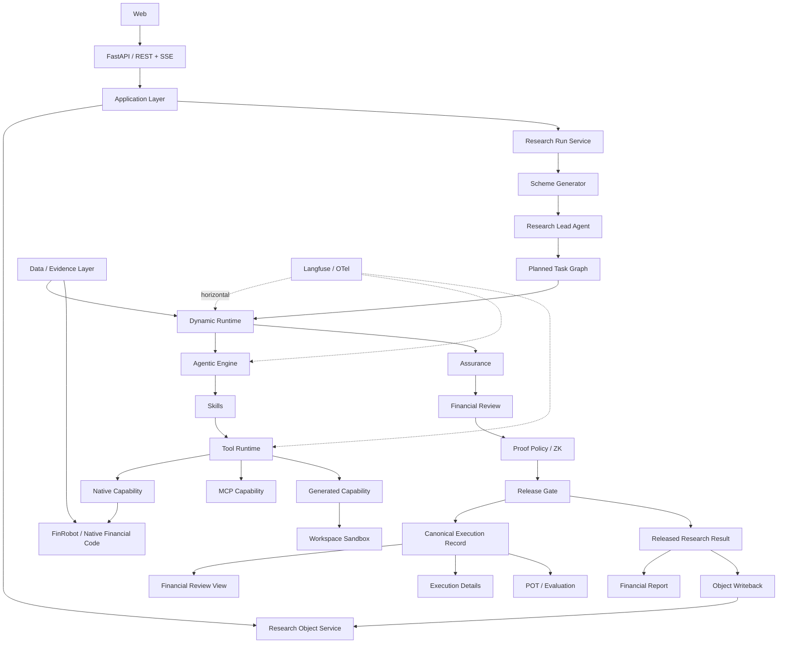

# Verifiable Financial AI — 后端架构与执行设计 V1

[English](02_BACKEND_ARCHITECTURE_V1.md)

> 日期：2026-09-03<br>
> 状态：V1 后端基线 / 可开始工程实施<br>
> 产品定位：**以 Research Object 为长期资产，以 Research Run 为一次研究执行，以 Agent 规划 + Dynamic Runtime 为执行核心，以 Evidence / Code / Review / ZK 提供可复核性，并以 Financial Report 作为业务主输出。**

---

## 0. 本版冻结的关键修正

### 0.1 前端一级入口

MVP 前端只保留：

1. **新建任务**
2. **任务列表**
3. **研究对象**

`研究方案` 不作为独立配置页面。

### 0.2 Research Scheme 仍然存在，但改为“用户输入 + AI 生成”

用户在新建任务时提供：

- 研究对象
- Research Goal
- 可选研究偏好 / 范围 / 深度

系统由 AI 基于：

- 研究对象
- Research Goal
- Object 当前状态
- 可用 Data / Agent / Skill / Capability
- 系统硬规则

生成 **Research Scheme Snapshot**。

用户确认后，该 Scheme Snapshot 固化到本次 Research Run 中。

因此：

> Research Scheme 是一次 Run 的**研究方法快照**，不是 MVP 阶段的后台配置资产。

未来如果发现某些 Scheme 被高频复用，再考虑“保存为模板 / 方案库”，但不进入当前 MVP。

### 0.3 Task 的定义

用户不会手工创建内部 Task。

用户创建的是：

> **Research Run**

Task 是 Research Lead Agent 根据：

> Research Object + Research Goal + Confirmed Research Scheme

拆出来的可执行研究单元。

### 0.4 Agent 的纠错和 Replan 必须分开

- **Self-Correction**：不改变 Task Goal，在单个 Task 内完成纠错、重试、参数调整、证据重新选择。
- **Replan**：Task 内无法解决，或研究范围 / 依赖发生变化时，由 Specialist Agent 提交 Replan Request，Research Lead Agent 决定是否修改 Planned Task Graph。

默认逻辑：

> **Plan First → Execute → Self-Correct → Replan Only When Necessary**

### 0.5 结果层

A、B、C 不再被视为三个相同性质的“视图”。

- **A. Financial Report**：独立业务主输出。
- **B. Financial Review View**：金融专业复核视角。
- **C. Execution Details**：机器执行 / 工程复核视角。

B 和 C 基于同一份 **Canonical Execution Record**：

> 一次执行，一个事实，两个复核视角。

A 则由 Released Research Result 渲染形成，并通过 Claim / Evidence / Calculation ID 与 B/C 互相链接。

---

# 1. 产品主流程



---

# 2. 核心对象模型

## 2.1 ResearchObject

长期存在的研究主体。

示例：

```yaml
object_id: OBJ-NVDA
object_type: public_company
symbol: NVDA
company_name: NVIDIA Corporation
exchange: NASDAQ
sector: Semiconductors
currency: USD
```

Research Object 下长期沉淀：

- 规范财务状态
- 财务报表
- 数据包
- 证据（Evidence）
- 历史研究 Run
- 版本化财务判断
- 报告

---

## 2.2 ResearchGoal

用户真正希望回答的问题。

示例：

```yaml
goal_type: comprehensive_equity_research
goal_text: >
  评估 NVIDIA 当前的基本面、估值、主要风险以及未来投资价值。
as_of: 2026-09-03
```

Research Goal 回答：

> **研究什么？**

---

## 2.3 ResearchSchemeSnapshot

由 AI 生成，用户确认后固化到本次 Run。

示例：

```yaml
scheme_id: SCH-RUN023-V1
generated_for_run: RUN-023

research_scope:
  - fundamentals
  - peer_analysis
  - news_and_catalyst
  - technical
  - valuation
  - risk
  - synthesis

data_requirements:
  - financial_statements
  - market_data
  - peer_data
  - news

assurance_requirements:
  verified_data_only: true
  deterministic_numbers_use_code: true
  independent_review: true
  proof_policy: material_calculations

report_requirements:
  - financial_summary
  - charts
  - valuation
  - risks
  - investment_thesis
```

注意：

> Scheme 不是固定 Task List。

Research Lead Agent 仍需要结合 Object 当前状态和系统能力，将 Scheme 实例化成具体 Planned Task Graph。

---

## 2.4 ResearchRun

一次完整研究执行。

```yaml
run_id: RUN-023
research_object_id: OBJ-NVDA
goal_id: GOAL-023
scheme_snapshot_id: SCH-RUN023-V1
status: running
as_of: 2026-09-03
planned_graph_id: PG-023
actual_graph_id: AG-023
started_at: ...
completed_at: null
```

---

## 2.5 Task

Research Lead Agent 拆出来的可执行研究单元。

```yaml
task_id: TASK-B
run_id: RUN-023
task_type: peer_analysis
goal: 建立 NVDA / AMD / INTC 同口径同行数据集
assigned_agent: peer_analyst
skill_id: peer_analysis_v1
dependencies: []
origin: PLAN
status: running
```

`origin` 至少支持：

- `PLAN`
- `REPLAN`
- `REVIEW_FIX`

运行中新增 Task 必须保存：

```yaml
parent_task_id: TASK-B
trigger_event_id: EVT-...
reason_code: PEER_EVIDENCE_INSUFFICIENT
created_by: research_lead_agent
```

---

# 3. Research Lead Agent：规划阶段

Research Lead Agent 不是“一边跑一边随便加 Task”。

默认行为：

1. 理解 Object + Goal + Scheme。
2. 读取 Object 当前状态。
3. 识别已有数据与缺口。
4. 检查 Agent / Skill / Capability 可用性。
5. 编译 Control Plan。
6. 一次性生成完整 Initial Planned Task Graph。
7. 交给 Dynamic Runtime 执行。

规划结果拆成四类：

## 3.1 数据计划

定义：

- 需要哪些数据字段
- 需要哪些期间
- Object 已有哪些可复用数据
- 哪些数据需要刷新
- 数据源优先级
- 数据更新策略

## 3.2 能力计划

检查两类能力：

### 财务计算

例如：

- 营收增长率
- EBITDA 利润率
- ROE（净资产收益率）
- DCF
- EV / EBITDA
- 技术指标

### Agent / Skill

例如：

- 基本面分析师（Fundamental Analyst）
- 同行分析 Skill
- 估值 Skill
- 风险分析 Skill

如果规划阶段已经可以明确发现 Capability Gap，可以在正式执行前处理。

如果只有运行中才发现新 Gap，则进入 Controlled Replanning。

## 3.3 控制计划

定义：

- Langfuse／OTel 追踪上下文
- 财务审查策略
- 证明策略（Proof Policy）
- 发布策略
- 报告契约
- 成本／重试／重新规划预算

## 3.4 计划任务图（Planned Task Graph）

示例：

```text
Fundamental ─┐
Peer ────────┼── parallel
News ────────┤
Technical ───┘
      ↓
Valuation
      ↓
Risk
      ↓
Synthesis
```

---

# 4. Task 内部执行模型

每个 Task 内部遵循：



## 4.1 Self-Correction 适用问题

- Tool 暂时失败
- 输出 Schema 不合法
- 参数选择错误
- Evidence Period 选择错误
- 数据格式适配错误
- 一次金融计算验证失败
- Generated Code 测试未通过后的修改

这些默认都在 Task 内完成，不新增顶层 Task。

## 4.2 Replan 适用问题

- Evidence 缺失且需要新增研究工作
- 新发现改变后续依赖
- Capability 缺失
- 需要新的 Specialist Task
- 原计划无法回答 Research Goal
- 多次 Self-Correction 仍无法解决

Specialist Agent 不直接修改 Graph：

> Specialist Agent → Replan Request → Research Lead Agent → Approve / Reject → Graph Mutation

---

# 5. Agent / Skill / Capability / Tool Runtime

## 5.1 Agent

Agent 负责“判断与执行策略”。

MVP Agent：

- 研究 Lead Agent
- 基本面分析师（Fundamental Analyst）
- 同行分析师（Peer Analyst）
- 研究／新闻分析师
- 估值分析师（Valuation Analyst）
- 风险分析师（Risk Analyst）
- 代码构建 Agent

## 5.2 Skill

Skill 是 Agent 完成一类 Task 的方法包。

Skill 包含：

- 指令
- 输入 Schema
- 输出 Schema
- 允许的工具
- 必需证据
- 验证规则
- 纠错策略

例如：

```yaml
skill_id: fundamental_analysis_v1
allowed_tools:
  - financial.get_income_statement
  - financial.get_balance_sheet
  - financial.get_cash_flow
  - financial.calculate_revenue_growth
  - financial.calculate_ebitda_margin
requirements:
  evidence_required: true
  deterministic_numbers_use_code: true
```

## 5.3 Capability

系统真正可执行的能力。

三种 Backend：

```text
Native Capability
MCP Capability
Generated Capability
```

Agent 和 Skill 不需要关心底层 Backend 类型。

统一经过：

```text
Agent
  ↓
Skill
  ↓
Tool Runtime
  ↓
Capability Registry
  ↓
Native / MCP / Generated
```

---

# 6. MCP 的定位

系统已有 Python / FinRobot 模块 **不天然等于 MCP**。

MVP：

- 内部稳定金融模块优先走 `Native Capability`
- MCP 作为可插拔工具协议保留
- Generated Capability 走受控 Workspace / Sandbox

适合未来 MCP 化的能力：

- Bloomberg
- SEC／申报文件
- 本地文件
- 本地运行时
- 外部 Research Service
- 第三方 Agent / Data Provider

MVP 不为了“使用 MCP”强行把内部 Python 函数全部绕一层 MCP。

Tool Runtime 对上层统一暴露即可。

---

# 7. 数据／证据层

Data Layer 独立于普通 Research Task。



核心原则：

> **未经验证的数据不得进入正式财务推理。**

正式 Evidence 至少保存：

```yaml
evidence_id: EVID-101
object_id: OBJ-NVDA
provider: FMP
source_endpoint: ...
retrieved_at: ...
period: FY2025
as_of: 2026-09-03
raw_artifact_ref: ...
normalized_value: ...
unit: USD
status: accepted
snapshot_hash: ...
```

---

# 8. 财务代码层

第二条硬规则：

> **LLM 不得作为任何确定性财务数字的权威生成来源。**

正式金融数字链：

```text
Accepted Evidence
        ↓
Calculation Inputs
        ↓
Financial Code / Capability
        ↓
Calculation Record
        ↓
Financial Result
```

示例：

```yaml
calculation_id: CALC-027
capability_id: revenue_growth
capability_version: 1.2.0
input_evidence_ids:
  - EVID-101
  - EVID-102
formula_id: revenue_growth_v1
output:
  value: 0.655
  unit: ratio
status: pass
```

---


# 9. Capability Gap 与动态 Code

MVP 只做简单但真实的闭环：

```text
Capability Gap
      ↓
Web 提示用户
      ↓
用户确认
      ↓
Code Builder Agent
      ↓
Server Sandbox Workspace
      ↓
Generate Code
      ↓
Tests
      ↓
Financial Validation
      ↓
TASK_APPROVED
      ↓
Capability Registry
      ↓
Resume Original Task
```

## 9.1 执行工作区

服务器端目录建议：

```text
workspaces/
└── RUN-023/
    └── TASK-E/
        └── WS-014/
            ├── context/
            ├── inputs/
            ├── code/
            ├── tests/
            ├── outputs/
            ├── artifacts/
            └── manifest.json
```

默认 Sandbox 权限：

```text
Network        DENY
Host FS        DENY
Secrets        DENY
Database       DENY

Approved Input READ ONLY
Workspace      READ / WRITE
CPU / RAM      LIMITED
Timeout        REQUIRED
```

## 9.2 Generated Capability 生命周期

MVP：

```text
GENERATED
  ↓
TESTED
  ↓
FINANCIAL_VALIDATED
  ↓
TASK_APPROVED
```

`TASK_APPROVED` 只代表当前 Run / Task 可以使用。

后续再扩展：

```text
TASK_APPROVED
  ↓
REVIEWED
  ↓
CERTIFIED
  ↓
DEPRECATED
```

生成能力产物：

```yaml
capability_id: peer_adjusted_pe
version: 0.1.0
created_by: code_builder_agent
created_for_run: RUN-023
created_for_task: TASK-E
code_hash: sha256:...
tests:
  passed: 18
  failed: 0
financial_validation: pass
execution_target: SERVER_SANDBOX
lifecycle: TASK_APPROVED
```

---

# 10. 动态运行时

Dynamic Runtime 不是 Agent。

定义：

> 根据 Research Run 当前状态，执行 Planned Task Graph、管理并行、状态、重试、Self-Correction、Controlled Replanning、Workspace 和 Event Stream 的状态化运行引擎。

核心组件：

```text
Dynamic Runtime
├── Runtime State
├── Graph Engine
├── Scheduler
├── Tool Runtime
├── Workspace Runtime
├── Retry Policy
├── Budget Policy
├── Checkpoint Store
└── Event Bus
```

## 10.1 Planned Graph 与 Actual Graph

计划：

```text
A → B → E → F → G
```

Actual 可能变成：

```text
A
├─ self-correction
B
├─ evidence gap
└─ B.1 additional peer evidence
E
├─ capability gap
├─ generated capability
└─ resume E
F
G
```

必须同时保存：

- `PlannedTaskGraph`
- `ActualRuntimeGraph`

这样才能真正支撑：

- Web 动态 Task Board
- Langfuse 对照
- Replan 审计
- POT / Evaluation

---

# 11. 运行时事件契约

前端动态过程不能依赖 `setTimeout()` 猜状态。

后端：

```text
Dynamic Runtime
      ↓
Event Bus
      ↓
SSE
      ↓
Web
```

MVP Event 类型：

```text
run.created
run.started

scheme.generation_started
scheme.generated
scheme.confirmed

plan.generated

task.created
task.started
task.progress
task.self_correcting
task.correction_resolved
task.completed
task.failed

replan.requested
replan.approved
replan.rejected
graph.task_added

evidence.accepted
evidence.conflict

calculation.completed

capability.gap_detected
workspace.created
capability.generation_started
capability.tested
capability.validated

review.started
review.required
review.resolved

proof.started
proof.verified

release.completed
run.completed
```

示例：

```json
{
  "event_id": "EVT-382",
  "run_id": "RUN-023",
  "type": "task.started",
  "timestamp": "2026-09-03T20:31:04+08:00",
  "task_id": "TASK-A",
  "payload": {
    "task_type": "fundamental_analysis"
  }
}
```

Replan：

```json
{
  "event_id": "EVT-418",
  "run_id": "RUN-023",
  "type": "graph.task_added",
  "timestamp": "2026-09-03T20:37:12+08:00",
  "task_id": "TASK-B.1",
  "payload": {
    "origin": "REPLAN",
    "parent_task_id": "TASK-B",
    "reason_code": "PEER_EVIDENCE_INSUFFICIENT"
  }
}
```

---

# 12. Langfuse／可观测性

Langfuse 是横切 Runtime 的 Observability，不是普通 Task，也不是 Agent Tool。

需要自动记录：

- Research Lead 规划
- 专业 Agent 调用
- Skill 执行
- 工具调用
- 财务代码调用
- LLM 生成
- 重试
- 自纠
- 重新规划（Replan）
- 成本
- Token 用量
- 延迟
- 错误

应用关系：

```text
Research Run
  ↓
Runtime Context
  ↓
Agent / Skill / Tool / Code
  ↓
OpenTelemetry / Langfuse
```

数据库只保存：

- `trace_id`
- `span_id` / observation ref（需要时）
- 与业务对象关联的关键 ID

不把 Langfuse 当作业务 Source of Truth。

> Canonical Execution Record 仍然是产品业务事实；Langfuse 是技术运行观测证据。

---

# 13. 财务审查／ZK／发布

## 13.1 独立财务审查

Agent 可以自纠，但不能自己决定正式 PASS。

Task Results 汇总后进入独立 Review。

### 确定性审查

- 数值一致性
- 期间对齐
- 实际值／估计值冲突
- 单位／币种
- 证据存在性
- 计算一致性
- 必需数据完整性

### 语义审查

- Claim 是否被 Evidence 支撑
- 是否存在逻辑跳跃
- 是否存在 Evidence Conflict
- Claim 强度是否超过证据
- AI Judgment 是否有充分依据

状态：

```text
PASS
REVIEW
BLOCK
```

Review 失败：

```text
Review Finding
    ↓
Correction Request
    ↓
Original Task / Agent Self-Correction
    ↓
Resubmit
    ↓
Review Again
```

如果修复改变研究范围，则升级到 Replan。

---

## 13.2 证明策略（Proof Policy）

不是所有内容都 ZK。

适合 MVP 的证明对象：

1. 已接受证据哈希 → 营收增长率计算 → 结果
2. 价格序列哈希 → 技术指标
3. 最终数值主张一致性检查

流程：

```text
Financial Result
      ↓
Proof Policy
      ↓
MUST_PROVE ?
   ┌──┴──┐
   No    Yes
   ↓      ↓
Release  ZK Prover
          ↓
        Receipt
          ↓
       Verifier
          ↓
        Release
```

ZK 证明：

> 指定程序确实针对指定承诺输入执行并产生指定输出。

ZK 不证明：

- FMP 在现实世界中绝对正确
- LLM 不会幻觉
- “估值溢价合理”是客观真理

---

# 14. Result / Record 层

## 14.1 规范执行记录

一次执行唯一事实源。

```text
CanonicalExecutionRecord
├── Run Identity
├── Object Snapshot
├── Goal
├── Confirmed Scheme Snapshot
├── Planned Graph
├── Actual Graph
├── Tasks
├── Evidence Refs
├── Calculations
├── Agent Decisions
├── Corrections
├── Replans
├── Generated Capabilities
├── Reviews
├── Proofs
├── Trace Refs
├── Token
├── Cost
├── Latency
└── Runtime Outcome
```

## 14.2 B / C 两个复核视角

### B. 财务审查视图

金融语言：

```text
Claim
→ Evidence
→ Calculation
→ AI Judgment
→ Review Status
→ Proof
```

### C. 执行详情

机器语言：

```text
Task
→ Agent
→ Skill
→ Tool
→ Code
→ Retry
→ Correction
→ Replan
→ Langfuse Trace
→ Cost / Token / Latency
```

二者必须投影自同一个 Canonical Execution Record。

---

## 14.3 已发布研究结果

通过 Review / Proof / Release Gate 后形成。

包含：

- 结构化财务结果
- 已发布主张
- 财务判断
- 假设引用
- 风险输出
- 报告数据模型

## 14.4 A. 财务报告

独立业务主输出。

由 Released Research Result 进入 Report Renderer：

```text
Released Research Result
      ↓
Financial Report Renderer
      ↓
HTML / PDF
```

报告包括：

- 财务报表／指标
- 图表
- 基本面分析
- 同行分析
- 估值
- 风险
- 催化剂
- 投资论点
- 假设／限制
- 已验证／审查徽标

报告中的关键 Claim / Number 可通过 ID 下钻至 Financial Review View。

---

# 15. 研究对象回写

Run 完成后不是“整份报告写回 Object”。

流程：

```text
Released Research Result
       ↓
Object Writeback Gate
       ↓
Research Object State
```

分类：

### 事实（Fact）

可更新 Canonical State：

- 营收
- 现金
- 债务
- 市值

### 确定性计算

可版本化写入：

- 营收增长率
- EBITDA 利润率
- ROE（净资产收益率）
- 债务／权益比率

### 预测（Forecast）

必须带：

- 假设集合
- Run ID
- 截至日期
- 模型／计算版本

### AI 判断

必须保存为版本化 Judgment：

```yaml
judgment_id: JUDG-...
run_id: RUN-023
task_id: TASK-F
judgment_type: valuation_view
value: premium
evidence_ids: [...]
model: ...
skill_version: ...
created_at: ...
```

不能把 AI Judgment 当成永久 Fact。

---

# 16. 跨对象比较

Comparison 不做“一次任务研究多个对象”。

流程：

```text
NVDA Object State
AMD Object State
INTC Object State
        ↓
Comparability Gate
        ↓
Comparison Dataset
        ↓
Code Comparison
        ↓
AI Comparative Analysis
```

Comparability Gate 至少检查：

- 指标定义
- 期间
- 币种
- 实际值／估计值
- 公式版本
- 数据新鲜度

---

# 17. POT / Evaluation

POT 在 Research Run 完成后消费：

- 规范执行记录
- 审查结果
- 人工反馈
- 成本
- Token 用量
- 延迟
- 纠错次数
- 重新规划次数
- 任务结果

用于评价：

- 模型
- Agent
- Skill
- Capability
- 路由策略
- 成本／质量权衡

MVP：

> 先做 Task Evaluation 记录，不急着实现复杂 RL。

---

# 18. 开源框架引入策略

## 18.1 FinRobot

官方仓库：

- https://github.com/AI4Finance-Foundation/FinRobot

MVP 定位：

> **嵌入式财务运行时／能力来源**

不把 FinRobot 固定 Equity Pipeline 直接当作我们的 Orchestrator。

建议：

```text
Agent / Skill
    ↓
Capability Registry
    ↓
FinRobot Adapter
    ↓
FinRobot Financial Functions / Renderer
```

可优先复用：

- 财务数据处理器
- FMP 连接器逻辑
- 增长率／利润率计算
- 同行聚合
- 技术计算
- 基础图表
- 专业 HTML／PDF 渲染器

不建议直接复用为主架构：

- 固定股票研究流水线编排
- 旧版 AutoGen 工作流
- 直接 LLM 章节生成器
- 未经重新验证的简化估值假设

Repo：

```text
third_party/
└── FinRobot/   # Git submodule, pinned commit
```

当前已确认 baseline 可继续使用：

```text
d221910096de87579b02f8f0674652bf1a175f51
```

比赛前保留：

- 赛前标签
- 完整 Git 历史
- `ORIGINALITY_AND_REUSE.md`

FinRobot 当前 package metadata 要求 Python `>=3.10,<3.12`，因此 MVP 建议统一 **Python 3.11**。

---

## 18.2 Langfuse

官方：

- https://langfuse.com/docs/observability/sdk/overview
- https://github.com/langfuse/langfuse

定位：

> **运行时可观测性**

不作为 Agent Tool。

Python 后端直接接 Langfuse Python SDK / OpenTelemetry。

埋点位置：

- Run 根追踪
- 规划 span
- 任务 span
- Agent 生成
- Skill 执行
- 工具调用
- 计算调用
- 纠错
- 重新规划（Replan）
- 审查（Review）
- 证明适配器调用

环境变量：

```text
LANGFUSE_PUBLIC_KEY
LANGFUSE_SECRET_KEY
LANGFUSE_BASE_URL
```

无 Key 时允许使用 No-op Trace Adapter，不能阻塞核心业务。

---

## 18.3 RISC Zero

官方：

- https://dev.risczero.com/
- https://github.com/risc0/risc0

定位：

> **ZK 验证供应商**

不证明 LLM narrative。

推荐独立：

```text
proofs/
└── risc0/
    ├── host/
    └── methods/
```

Python Backend：

```text
ProofPolicy
   ↓
RiscZeroAdapter
   ↓
Rust Host
   ↓
Guest Program
   ↓
Receipt
   ↓
Verifier
```

MVP 只做 1 个真实证明闭环：

> `Revenue Growth / Numeric Consistency`

开发阶段可以使用 dev-mode 提速，但最终比赛演示必须生成真实 Receipt / Proof 并验证。

---

## 18.4 RD-Agent

官方：

- https://github.com/microsoft/RD-Agent
- https://www.microsoft.com/en-us/research/articles/rd-agent/

定位：

> **仅作为架构参考**

MVP 不把 RD-Agent 作为主 Runtime dependency。

借鉴：

```text
Research
→ Develop
→ Experiment
→ Feedback
→ Iterate
```

映射到：

```text
Capability Gap
→ Requirement
→ Code Builder
→ Sandbox
→ Tests
→ Feedback
→ Fix
→ TASK_APPROVED Capability
```

RD-Agent 官方当前主要使用 Docker 执行代码，因此我们的 Server Sandbox 也优先用 Docker 隔离。

---

## 18.5 MCP

官方 Python SDK：

- https://py.sdk.modelcontextprotocol.io/
- https://github.com/modelcontextprotocol/python-sdk

定位：

> **可选工具协议**

Tool Runtime：

```text
NativeToolBackend
MCPToolBackend
GeneratedToolBackend
```

MVP：

- FinRobot／内部财务代码 → Native
- Generated Capability → 工作区后端
- MCP 只搭接口，不强制内部模块 MCP 化

未来本地 Desktop / Terminal Runtime、Bloomberg、SEC 等能力再重点使用 MCP。

---

# 19. 整体后端架构



---

# 20. 存储设计

## PostgreSQL

结构化业务数据：

- research_objects
- research_goals
- research_scheme_snapshots
- research_runs
- tasks
- task_dependencies
- runtime_events
- evidence_records
- calculation_records
- agent_decisions
- correction_records
- replan_records
- capabilities
- generated_capability_records
- review_records
- proof_records
- canonical_execution_records
- released_research_results
- report_assets
- object_state_versions
- evaluation_records

## 产物存储

MVP 本地：

```text
artifacts/
```

后续 S3 / MinIO。

存：

- 原始 JSON
- CSV
- 图表
- HTML
- PDF
- 证明 receipt
- 生成代码
- 测试日志
- 工作区产物

## Langfuse

存 Technical Trace。

PostgreSQL 只保存 Trace Ref。

---

# 21. API 契约 — MVP

## 研究对象

```text
GET  /api/objects
POST /api/objects
GET  /api/objects/{object_id}
GET  /api/objects/{object_id}/state
GET  /api/objects/{object_id}/financials
GET  /api/objects/{object_id}/runs
```

## 新建任务／Research Run

```text
POST /api/research-runs/prepare
```

输入：

```json
{
  "research_object_id": "OBJ-NVDA",
  "research_goal": "评估 NVIDIA 当前的基本面、估值、主要风险以及未来投资价值。",
  "as_of": "2026-09-03",
  "preferences": {
    "depth": "standard"
  }
}
```

输出 AI Generated Scheme：

```json
{
  "draft_id": "DRAFT-023",
  "scheme": { "...": "..." }
}
```

用户确认：

```text
POST /api/research-runs
```

```json
{
  "draft_id": "DRAFT-023",
  "confirm_scheme": true
}
```

返回：

```json
{
  "run_id": "RUN-023",
  "status": "created"
}
```

## Run

```text
GET /api/research-runs/{run_id}
GET /api/research-runs/{run_id}/tasks
GET /api/research-runs/{run_id}/result
GET /api/research-runs/{run_id}/events
```

`events` 使用 SSE。

## 审查（Review）

```text
POST /api/reviews/{review_id}/resolve
```

## 能力缺口（Capability Gap）

```text
POST /api/research-runs/{run_id}/capability-gaps/{gap_id}/generate
POST /api/research-runs/{run_id}/capability-gaps/{gap_id}/skip
```

---

# 22. 最终 Repo 目录

```text
verifiable-financial-ai/
│
├── apps/
│   ├── api/
│   │   ├── main.py
│   │   ├── routes/
│   │   │   ├── objects.py
│   │   │   ├── research_runs.py
│   │   │   ├── reviews.py
│   │   │   ├── capability_gaps.py
│   │   │   └── events.py
│   │   └── dependencies.py
│   │
│   └── web/
│
├── src/
│   ├── domain/
│   │   ├── research_object.py
│   │   ├── research_goal.py
│   │   ├── research_scheme.py
│   │   ├── research_run.py
│   │   ├── task.py
│   │   ├── evidence.py
│   │   ├── calculation.py
│   │   ├── capability.py
│   │   ├── review.py
│   │   ├── proof.py
│   │   ├── canonical_execution_record.py
│   │   └── released_research_result.py
│   │
│   ├── application/
│   │   ├── object_service.py
│   │   ├── run_service.py
│   │   ├── scheme_service.py
│   │   ├── review_service.py
│   │   └── report_service.py
│   │
│   ├── agentic/
│   │   ├── agents/
│   │   │   ├── research_lead.py
│   │   │   ├── fundamental.py
│   │   │   ├── peer.py
│   │   │   ├── research_news.py
│   │   │   ├── valuation.py
│   │   │   ├── risk.py
│   │   │   └── code_builder.py
│   │   ├── skills/
│   │   │   ├── scheme_generation/
│   │   │   ├── research_planning/
│   │   │   ├── fundamental_analysis/
│   │   │   ├── peer_analysis/
│   │   │   ├── news_analysis/
│   │   │   ├── technical_analysis/
│   │   │   ├── valuation_analysis/
│   │   │   ├── risk_analysis/
│   │   │   ├── research_synthesis/
│   │   │   └── code_generation/
│   │   ├── router.py
│   │   ├── self_correction.py
│   │   ├── replan.py
│   │   └── registry.py
│   │
│   ├── data/
│   │   ├── acquisition.py
│   │   ├── freshness.py
│   │   ├── validation.py
│   │   ├── normalization.py
│   │   ├── canonicalization.py
│   │   └── repository.py
│   │
│   ├── capabilities/
│   │   ├── registry.py
│   │   ├── financial/
│   │   │   ├── statements.py
│   │   │   ├── growth.py
│   │   │   ├── profitability.py
│   │   │   ├── financial_health.py
│   │   │   ├── peer.py
│   │   │   ├── valuation.py
│   │   │   └── technical.py
│   │   └── generated/
│   │
│   ├── tooling/
│   │   ├── runtime.py
│   │   ├── native.py
│   │   ├── mcp.py
│   │   └── generated.py
│   │
│   ├── runtime/
│   │   ├── engine.py
│   │   ├── graph.py
│   │   ├── scheduler.py
│   │   ├── state.py
│   │   ├── events.py
│   │   ├── sse.py
│   │   ├── checkpoint.py
│   │   ├── retry.py
│   │   ├── budget.py
│   │   └── workspace/
│   │       ├── manager.py
│   │       ├── sandbox.py
│   │       └── executor.py
│   │
│   ├── assurance/
│   │   ├── deterministic_review.py
│   │   ├── semantic_review.py
│   │   ├── proof_policy.py
│   │   ├── release_gate.py
│   │   └── human_review.py
│   │
│   ├── observability/
│   │   ├── tracing.py
│   │   └── langfuse_adapter.py
│   │
│   ├── output/
│   │   ├── canonical_execution.py
│   │   ├── released_result.py
│   │   ├── financial_report.py
│   │   ├── financial_review_view.py
│   │   └── execution_view.py
│   │
│   ├── evaluation/
│   │   ├── run_evaluation.py
│   │   └── pot.py
│   │
│   ├── adapters/
│   │   ├── fmp/
│   │   ├── finrobot/
│   │   ├── llm/
│   │   ├── risc0/
│   │   └── mcp/
│   │
│   └── infrastructure/
│       ├── database/
│       ├── artifact_store/
│       ├── queue/
│       ├── secrets/
│       └── config/
│
├── proofs/
│   └── risc0/
│       ├── host/
│       └── methods/
│
├── contracts/
│   ├── api/
│   ├── events/
│   └── schemas/
│
├── third_party/
│   └── FinRobot/
│
├── workspaces/
├── artifacts/
├── tests/
│   ├── unit/
│   ├── integration/
│   ├── financial/
│   ├── regression/
│   └── acceptance/
│
├── docs/
│   ├── VERIFIABLE_FINANCIAL_AI_BACKEND_ARCHITECTURE_V1.md
│   └── ORIGINALITY_AND_REUSE.md
│
├── pyproject.toml
└── README.md
```

---

# 23. MVP 实施优先级

## Phase 1 — 后端骨架与契约

实现：

- 仓库骨架
- FastAPI
- 领域 schema
- Research Object API
- Research Run 准备／确认 API
- AI Scheme Generator 接口
- Planned Task Graph schema
- Runtime Event schema
- SSE
- SQLite 测试数据库／PostgreSQL 目标
- No-op Langfuse 适配器
- Capability Registry 接口
- 测试

## Phase 2 — 一条真实财务纵向切片

实现：

```text
NVDA Object
→ FMP / Fixture Evidence
→ Fundamental Task
→ Revenue Growth / EBITDA Margin Code
→ Calculation Record
→ Financial Review
→ Released Result
→ Financial Report JSON
```

## Phase 3 — 动态运行时

实现：

- 并行任务
- Task 内自纠
- 重新规划请求
- 图变更
- 实际运行时图

## Phase 4 — 开源集成

- FinRobot 适配器
- Langfuse 真实追踪
- 能力工坊／Docker
- RISC Zero 单项真实证明

## Phase 5 — 结果与对象

- 财务报告渲染器
- 审查视图
- 执行视图
- 对象回写
- 跨对象比较
- 评估／POT

---

# 24. V1 验收标准

后端 V1 不以“目录创建完成”为验收，而以最小闭环为准：

1. 能创建 / 查询 Research Object。
2. 用户输入 Object + Goal。
3. AI 或 fallback 能生成 Research Scheme Snapshot。
4. 用户确认后创建 Research Run。
5. Research Lead Planner 生成 Planned Task Graph。
6. Runtime 能通过 SSE 推送真实 Task 状态事件。
7. 至少一个 Financial Task 使用 Accepted Evidence。
8. 至少一个正式金融数字由 Code 产生并形成 Calculation Record。
9. Task 支持 Self-Correction 事件。
10. 支持一个 Replan Request → Graph Mutation 示例。
11. Langfuse adapter 接口存在，并在有 Key 时真实 trace。
12. Review Gate 可以 PASS / REVIEW / BLOCK。
13. Proof Policy 接口存在。
14. 最终产生 Canonical Execution Record。
15. B / C 两个复核 View 来自同一 Execution Record。
16. Released Research Result 可形成 Financial Report 数据。
17. Run 结果可回写 Research Object。
18. 全部自动测试通过。

---

# 25. 参考来源

- FinRobot: https://github.com/AI4Finance-Foundation/FinRobot
- Langfuse Observability: https://langfuse.com/docs/observability/sdk/overview
- Langfuse GitHub: https://github.com/langfuse/langfuse
- RD-Agent: https://github.com/microsoft/RD-Agent
- Microsoft Research RD-Agent overview: https://www.microsoft.com/en-us/research/articles/rd-agent/
- RISC Zero Developer Docs: https://dev.risczero.com/
- RISC Zero GitHub: https://github.com/risc0/risc0
- MCP Python SDK: https://py.sdk.modelcontextprotocol.io/
- MCP Python SDK GitHub: https://github.com/modelcontextprotocol/python-sdk

---

# 26. 最终工程定义

> 用户围绕一个 Research Object 输入金融研究目标，AI 生成并由用户确认本次 Research Scheme；Research Lead Agent 根据 Object、Goal、Scheme、已有数据和系统能力一次性制定 Initial Planned Task Graph，由 Dynamic Runtime 按依赖并行分发给 Specialist Agents。每个 Task 在内部通过 Skill + Tool / Capability 执行并优先 Self-Correct；只有无法在 Task 内解决的问题才提交 Replan Request，由 Research Lead Agent 受控修改 Graph。所有正式数据先经过 Evidence Layer，所有确定性金融数字由 Code 产生。任务结果必须经过独立 Financial Review，并对达到 Proof Policy 门槛的关键确定性步骤生成真实 ZK Proof；Release 后形成 Released Research Result 与 Canonical Execution Record。Financial Report 是独立业务输出，Financial Review View 与 Execution Details 是同一次执行事实的两个复核视角。最终 Run 资产回写 Research Object，并进入跨对象比较与 POT / Evaluation。
