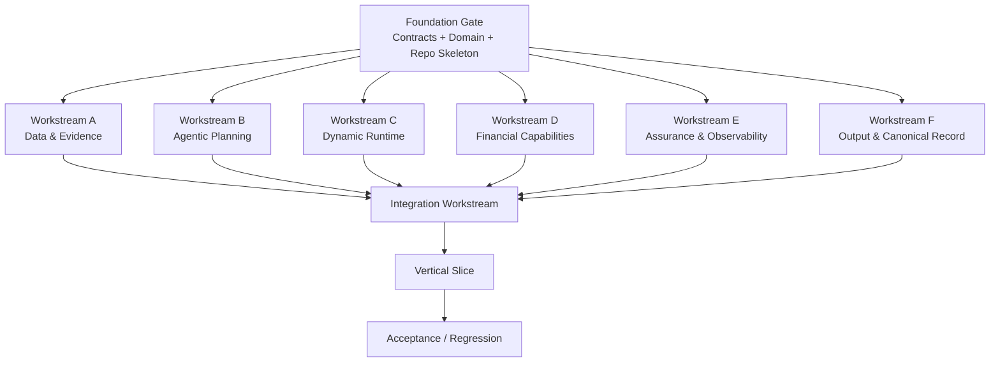

# 19 — Parallel Module Build & Integration Plan V1

[简体中文](19_PARALLEL_MODULE_BUILD_AND_INTEGRATION_V1.zh-CN.md)

## 1. Purpose

Backend implementation must not be executed as one long serial task.

The project should be built as:

> **Foundation Gate → Parallel Module Workstreams → Contract Validation → Integration → Acceptance**

The goal is to let multiple Codex / engineering agents build independent modules at the same time without creating conflicting implementations.

---

# 2. Core parallelization principle

Parallelize by **bounded module ownership**, not by arbitrary files.

Each workstream owns:

- its module directory
- its tests
- its internal implementation
- its local adapters

Each workstream consumes shared contracts but may not redefine them.

Shared contracts are frozen by the Foundation workstream.

---

# 3. Parallel execution graph



---

# 4. Foundation Gate

This is the only short serial stage before broad parallel work begins.

Must freeze:

- repo structure
- Python version
- pyproject / dependency baseline
- domain IDs and enums
- Pydantic schemas
- API request/response contracts
- RuntimeEvent schema
- TaskStatus / RunStatus
- database base / repository interfaces
- Capability interface
- TraceAdapter interface
- ProofAdapter interface
- core test fixtures
- naming conventions

Foundation must not implement all business logic.

It exists to prevent parallel workstreams from inventing incompatible types.

---

# 5. Workstream A — Data & Evidence

Owner:

```text
src/data/
src/adapters/fmp/
src/domain/evidence.py
tests/financial/evidence*
tests/unit/data*
```

Responsibilities:

- data acquisition interface
- fixture provider
- FMP adapter boundary
- freshness
- validation
- normalization
- conflict detection
- Accepted Evidence Snapshot
- EvidenceRecord persistence

Output contract:

```text
AcceptedEvidenceBundle
EvidenceRecord[]
```

Hard rule:

> Raw provider JSON must not directly enter Agent or Financial Code.

Does not own:

- Agent planning
- Runtime scheduler
- Financial formulas
- Review
- Report

---

# 6. Workstream B — Agentic Planning

Owner:

```text
src/agentic/
tests/unit/agentic*
```

Responsibilities:

- SchemeGenerator interface
- fallback Scheme generation
- Research Lead Planner
- Specialist role interfaces
- Skill contracts
- Self-Correction decision interface
- ReplanRequest
- Agent / Skill registry

Output contracts:

```text
ResearchSchemeSnapshot
PlannedTaskGraph
ReplanRequest
StructuredAgentDecision
```

Does not own:

- Graph mutation implementation
- scheduling
- Evidence persistence
- financial formulas
- Langfuse infrastructure
- ZK

---

# 7. Workstream C — Dynamic Runtime

Owner:

```text
src/runtime/
apps/api/routes/events.py
tests/unit/runtime*
tests/integration/runtime*
```

Responsibilities:

- Runtime State
- Planned / Actual Graph
- dependency scheduler
- asyncio parallel execution
- Task lifecycle
- graph mutation
- retry
- checkpoint
- RuntimeEvent persistence
- SSE stream
- replay / sequence ordering

Consumes:

- PlannedTaskGraph from Agentic
- TaskExecutor registry
- RuntimeEvent contract

Does not decide:

- financial formulas
- semantic research logic
- review policy

---

# 8. Workstream D — Financial Capabilities

Owner:

```text
src/capabilities/
src/tooling/
src/adapters/finrobot/
tests/financial/calculations*
```

Responsibilities:

- CapabilityRegistry
- ToolRuntime
- NativeToolBackend
- MCPToolBackend interface
- GeneratedToolBackend interface
- deterministic financial formulas
- CalculationRecord creation
- FinRobot adapter boundary
- at least one real vertical financial capability

Initial capabilities:

- revenue_growth
- ebitda_margin
- statement access interface

Hard rule:

> Deterministic financial numbers are produced only through this layer.

Does not own:

- Agent planning
- Review
- Runtime scheduling

---

# 9. Workstream E — Assurance & Observability

Owner:

```text
src/assurance/
src/observability/
src/adapters/risc0/
tests/unit/assurance*
```

Responsibilities:

- deterministic review
- semantic review interface
- ReviewRecord
- ProofPolicy
- ProofAdapter interface
- ReleaseGate
- LangfuseTraceAdapter
- NoopTraceAdapter
- trace wrapper semantics

Phase 1:

- real deterministic review
- proof interface / NOT_IMPLEMENTED state
- Langfuse optional real connection

Hard rule:

> Agent cannot bypass this workstream.

---

# 10. Workstream F — Canonical Record & Output

Owner:

```text
src/output/
src/domain/canonical_execution_record.py
src/domain/released_research_result.py
tests/unit/output*
```

Responsibilities:

- CanonicalExecutionRecord builder
- ReleasedResearchResult
- Financial Review projection
- Execution projection
- Financial Report data model
- Object writeback proposal
- projection consistency tests

Hard rule:

> Financial Review View and Execution Details must use the same CanonicalExecutionRecord ID.

---

# 11. Integration Workstream

Integration starts only after each module publishes:

1. module test result
2. implemented interfaces
3. known gaps
4. files changed
5. contract deviations = NONE or explicitly approved

Integration owns:

```text
src/application/
apps/api/
tests/integration/
tests/acceptance/
```

Integration responsibilities:

```text
Object
→ Goal
→ Scheme
→ Run
→ Lead Planner
→ Planned Graph
→ Runtime
→ Evidence
→ Financial Capability
→ Self-Correction
→ Replan
→ Review
→ Canonical Record
→ Released Result
```

No module is considered integrated merely because it imports successfully.

---

# 12. File ownership rules

To avoid multi-writer conflicts:

## Foundation-owned shared files

Only coordinator / foundation modifies:

```text
pyproject.toml
src/domain/shared enums
contracts/
apps/api/main.py
database base config
global settings
```

After Foundation Gate they are treated as frozen.

Any required change must be submitted as:

```text
CONTRACT_CHANGE_REQUEST
```

and merged by coordinator.

## Workstream-owned files

A workstream may freely edit only its declared ownership paths.

---

# 13. Branch / Worktree strategy

Recommended:

```text
main
├─ ws/foundation
├─ ws/data-evidence
├─ ws/agentic
├─ ws/runtime
├─ ws/financial-capabilities
├─ ws/assurance
├─ ws/output
└─ ws/integration
```

Or Git worktrees:

```text
../w_fdn
../w_data
../w_agentic
../w_runtime
../w_finance
../w_assurance
../w_output
../w_integration
```

Never run multiple writers against the same checkout.

---

# 14. Merge order

Recommended:

```text
1 Foundation
2 Data & Evidence
3 Financial Capabilities
4 Agentic Planning
5 Dynamic Runtime
6 Assurance
7 Canonical Record / Output
8 Integration
9 Acceptance
```

This is merge order, not development order.

Development of 2–7 happens largely in parallel.

---

# 15. Module completion contract

Every workstream must produce:

```text
WORKSTREAM_REPORT.md
```

with:

```text
Scope
Files changed
Interfaces implemented
Tests
Known gaps
Contract deviations
Integration notes
```

No vague “done”.

---

# 16. Parallel acceptance gates

## Gate P0 — Foundation

PASS only when:

- imports work
- contracts compile
- base tests pass
- enums freeze
- no duplicate domain definitions

## Gate P1 — Module

Each module:

- unit tests pass
- no forbidden cross-layer imports
- contract conformity pass

## Gate P2 — Cross-module integration

- Evidence → Capability works
- Planner → Runtime works
- Runtime → Assurance works
- Runtime → Event stream works
- Canonical record can assemble all refs

## Gate P3 — Vertical slice

Must execute one complete run.

## Gate P4 — Acceptance

Full offline acceptance suite.

---

# 17. Parallel Codex orchestration

If using multiple Codex sessions:

1. Main Coordinator executes Foundation.
2. Coordinator creates / assigns worktrees.
3. Each workstream receives only:
   - architecture decisions
   - data contracts
   - its workstream prompt
4. Each session commits its branch.
5. Coordinator reads each WORKSTREAM_REPORT.
6. Coordinator merges only after module gate passes.
7. Integration session executes end-to-end.
8. Final acceptance session is independent from implementation sessions when possible.

---

# 18. Why this matters for this product

This architecture mirrors the product itself:

```text
Research Lead
→ split Tasks
→ parallel Specialists
→ aggregate
```

Engineering uses the same principle:

```text
Coordinator
→ split Modules
→ parallel Workstreams
→ integration
```

This reduces implementation time while preserving a single source of truth through frozen contracts.
