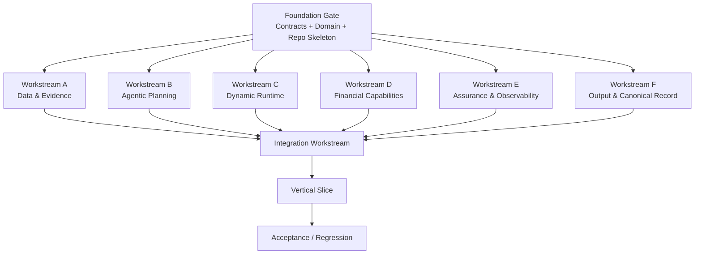

# 19 — 并行模块构建与集成计划 V1

[English](19_PARALLEL_MODULE_BUILD_AND_INTEGRATION_V1.md)

## 1. 目的

后端实现不应作为一项漫长串行任务执行。

项目应按以下流程构建：

> **基础门 → 并行模块工作线 → 契约验证 → 集成 → 验收**

目标是让多个 Codex／工程代理同时构建独立模块，而不产生互相冲突的实现。

---

# 2. 核心并行原则

按**有界模块职责**并行，而不是按任意文件划分。

每条工作线负责：

- 自己的模块目录
- 自己的测试
- 自己的内部实现
- 自己的局部适配器

每条工作线使用共享契约，但不得重新定义它们。

共享契约由基础工作线冻结。

---

# 3. 并行执行图



---

# 4. 基础门

这是开展广泛并行工作前唯一短暂的串行阶段。

必须冻结：

- 仓库结构
- Python 版本
- pyproject／依赖基线
- 领域 ID 与枚举
- Pydantic schema
- API 请求／响应契约
- RuntimeEvent schema
- TaskStatus／RunStatus
- 数据库基类／仓储接口
- Capability 接口
- TraceAdapter 接口
- ProofAdapter 接口
- 核心测试 fixture
- 命名约定

基础工作线不应实现所有业务逻辑。

它的作用是防止并行工作线自行创造不兼容的类型。

---

# 5. 工作线 A — 数据与证据

负责范围：

```text
src/data/
src/adapters/fmp/
src/domain/evidence.py
tests/financial/evidence*
tests/unit/data*
```

职责：

- 数据获取接口
- fixture 供应商
- FMP 适配器边界
- 新鲜度
- 校验
- 规范化
- 冲突检测
- 已接受证据快照
- EvidenceRecord 持久化

输出契约：

```text
AcceptedEvidenceBundle
EvidenceRecord[]
```

硬规则：

> 供应商原始 JSON 不得直接进入 Agent 或财务代码。

不负责：

- Agent 规划
- 运行时调度器
- 财务公式
- 审查（Review）
- 报告

---

# 6. 工作线 B — Agent 规划

负责范围：

```text
src/agentic/
tests/unit/agentic*
```

职责：

- SchemeGenerator 接口
- 回退 Scheme 生成
- Research Lead 规划器
- 专业角色接口
- Skill 契约
- 自纠决策接口
- ReplanRequest
- Agent／Skill 注册表

输出契约：

```text
ResearchSchemeSnapshot
PlannedTaskGraph
ReplanRequest
StructuredAgentDecision
```

不负责：

- 图变更实现
- 调度
- 证据持久化
- 财务公式
- Langfuse 基础设施
- ZK

---

# 7. 工作线 C — 动态运行时

负责范围：

```text
src/runtime/
apps/api/routes/events.py
tests/unit/runtime*
tests/integration/runtime*
```

职责：

- 运行时状态
- 计划图／实际图
- 依赖调度器
- asyncio 并行执行
- Task 生命周期
- 图变更
- 重试
- 检查点
- RuntimeEvent 持久化
- SSE 流
- 回放／序列排序

使用：

- 来自 Agentic 的 PlannedTaskGraph
- TaskExecutor 注册表
- RuntimeEvent 契约

不决定：

- 财务公式
- 研究语义逻辑
- 审查策略

---

# 8. 工作线 D — 财务能力

负责范围：

```text
src/capabilities/
src/tooling/
src/adapters/finrobot/
tests/financial/calculations*
```

职责：

- CapabilityRegistry
- ToolRuntime
- NativeToolBackend
- MCPToolBackend 接口
- GeneratedToolBackend 接口
- 确定性财务公式
- CalculationRecord 创建
- FinRobot 适配器边界
- 至少一项真实纵向财务能力

初始能力：

- revenue_growth
- ebitda_margin
- 报表访问接口

硬规则：

> 确定性财务数字只能经此层产生。

不负责：

- Agent 规划
- 审查（Review）
- 运行时调度

---

# 9. 工作线 E — 保障与可观测性

负责范围：

```text
src/assurance/
src/observability/
src/adapters/risc0/
tests/unit/assurance*
```

职责：

- 确定性审查
- 语义审查接口
- ReviewRecord
- ProofPolicy
- ProofAdapter 接口
- ReleaseGate
- LangfuseTraceAdapter
- NoopTraceAdapter
- 追踪包装语义

Phase 1：

- 真实确定性审查
- 证明接口／NOT_IMPLEMENTED 状态
- Langfuse 可选真实连接

硬规则：

> Agent 不得绕过此工作线。

---

# 10. 工作线 F — 规范记录与输出

负责范围：

```text
src/output/
src/domain/canonical_execution_record.py
src/domain/released_research_result.py
tests/unit/output*
```

职责：

- CanonicalExecutionRecord 构建器
- ReleasedResearchResult
- 财务审查投影
- 执行投影
- 财务报告数据模型
- 对象回写提案
- 投影一致性测试

硬规则：

> Financial Review View 与 Execution Details 必须使用同一个 CanonicalExecutionRecord ID。

---

# 11. 集成工作线

只有每个模块发布以下内容后才开始集成：

1. 模块测试结果
2. 已实现接口
3. 已知缺口
4. 变更文件
5. 契约偏差 = NONE 或已获明确批准

集成工作线负责：

```text
src/application/
apps/api/
tests/integration/
tests/acceptance/
```

集成职责：

```text
Object
→ Goal
→ Scheme
→ Run
→ Lead Planner
→ Planned Graph
→ Runtime
→ Evidence
→ Financial Capability
→ Self-Correction
→ Replan
→ Review
→ Canonical Record
→ Released Result
```

不能仅因模块成功导入就认为它已完成集成。

---

# 12. 文件职责规则

为避免多写者冲突：

## 基础工作线负责的共享文件

仅协调者／基础工作线可以修改：

```text
pyproject.toml
src/domain/shared enums
contracts/
apps/api/main.py
database base config
global settings
```

基础门通过后，这些文件视为冻结。

任何必要变更必须提交为：

```text
CONTRACT_CHANGE_REQUEST
```

并由协调者合并。

## 工作线负责的文件

工作线只能自由编辑其已声明负责的路径。

---

# 13. 分支／Worktree 策略

建议：

```text
main
├─ ws/foundation
├─ ws/data-evidence
├─ ws/agentic
├─ ws/runtime
├─ ws/financial-capabilities
├─ ws/assurance
├─ ws/output
└─ ws/integration
```

或使用 Git worktree：

```text
../w_fdn
../w_data
../w_agentic
../w_runtime
../w_finance
../w_assurance
../w_output
../w_integration
```

绝不对同一检出目录运行多个写者。

---

# 14. 合并顺序

建议：

```text
1 Foundation
2 Data & Evidence
3 Financial Capabilities
4 Agentic Planning
5 Dynamic Runtime
6 Assurance
7 Canonical Record / Output
8 Integration
9 Acceptance
```

这是合并顺序，而非开发顺序。

第 2–7 项的开发大体并行进行。

---

# 15. 模块完成契约

每条工作线必须产出：

```text
WORKSTREAM_REPORT.md
```

内容包括：

```text
Scope
Files changed
Interfaces implemented
Tests
Known gaps
Contract deviations
Integration notes
```

不能只给出模糊的“完成”。

---

# 16. 并行验收门

## 门 P0 — 基础

仅在以下条件满足时 PASS：

- 导入正常
- 契约编译通过
- 基础测试通过
- 枚举冻结
- 无重复领域定义

## 门 P1 — 模块

每个模块：

- 单元测试通过
- 无禁止的跨层导入
- 契约一致性通过

## 门 P2 — 跨模块集成

- Evidence → Capability 正常
- Planner → Runtime 正常
- Runtime → Assurance 正常
- Runtime → 事件流正常
- 规范记录能组装所有引用

## 门 P3 — 纵向切片

必须执行一次完整 Run。

## 门 P4 — 验收

完整离线验收套件。

---

# 17. 并行 Codex 编排

使用多个 Codex 会话时：

1. 主协调者执行基础工作。
2. 协调者创建／分配 worktree。
3. 每条工作线仅接收：
   - 架构决策
   - 数据契约
   - 其工作线提示词
4. 每个会话提交自己的分支。
5. 协调者读取每份 WORKSTREAM_REPORT。
6. 协调者仅在模块门通过后合并。
7. 集成会话执行端到端流程。
8. 条件允许时，最终验收会话应独立于实现会话。

---

# 18. 这为何对本产品重要

此架构呼应产品本身：

```text
Research Lead
→ split Tasks
→ parallel Specialists
→ aggregate
```

工程使用相同原则：

```text
Coordinator
→ split Modules
→ parallel Workstreams
→ integration
```

这既减少实现时间，又通过冻结契约保留单一事实源。
