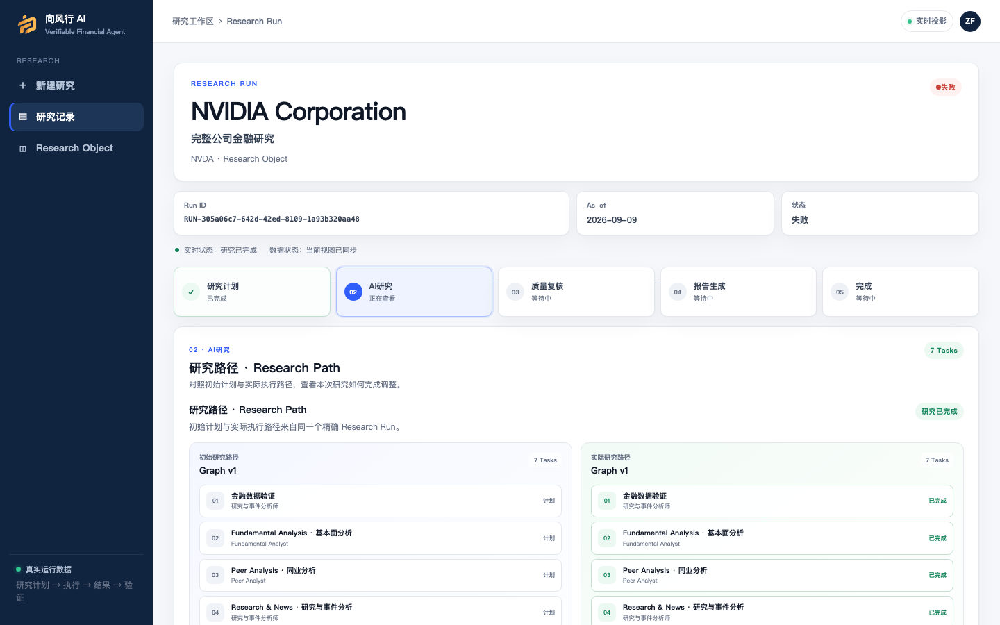

# 外部评估快照

[English](EVALUATION_README.md) · [产品体验参考](Verifiable_Financial_Agent_Product_Experience_Reference.html) · [安装说明](../deployment/INSTALL_EVALUATOR.zh-CN.md)

向风行 AI 将经用户审阅的研究目标转化为可观察的多 Agent 研究路径、确定性金融计算、独立 Financial Review、有限 Proof、可追踪结果和可复用 Research Memory。产品主线是：先做到能执行研究，再让证据与控制链值得检查，并让受治理的研究记忆持续积累。

这是 Controlled Alpha 评估快照，不是生产级可靠性认证、投资建议，也不宣称每个任务或上游 Provider 都会成功。

## 最新 fresh-download 验证

已从 GitHub 下载 `evaluation-candidate-2026-09-09-v3`，核验 ZIP SHA-256，在全新目录解压，将私有凭据放到 `credentials/active.vfacred`，执行内置 macOS 首次安装脚本和 `vfa doctor`。运行中 API 与 Broker 均匹配软件包 revision `fd5b3909ce1ff3fc27628ff1728de498c202a8a5` 及镜像 digest `sha256:8256d39ba01fecafb7ddc076d2908fd46a2e97f40996f137ab8cd34f26ea2274`。

唯一授权的 fresh-download NVDA Run `RUN-305a06c7-642d-42ed-8109-1a93b320aa48` 在 sequence 237 到达 `FAILED / FAILURE`。Evidence、fundamental、peer、news、synthesis 完成；valuation 与 risk 失败。Synthesis 本身正确经过 Sol 超时 → Luna 检查超时 → Terra 检查超时 → 授权 MiMo `mimo-v2.5` 成功；随后 Run 在 `POST_SCHEDULER` 因 `REQUIRED_CALCULATION_UNAVAILABLE` 关闭。Review、Proof、Report、ReleasedResult、Memory 均为 `NOT_GENERATED` / `NOT_OBSERVED`。没有重试或第二个 Run。

因此最新投资者等价状态为 `LIVE_BLOCKED_WITH_KNOWN_ISSUE`；下方较早的精确镜像本地成功基线仍是有效历史证据。

## 已执行 Live 的精确身份

| 项目 | 实际观察值 |
| --- | --- |
| Live 运行时源码 | `bcd3525a0e4a194f37775477027d988ed224bb6e` |
| Live 源码树 | `dabb2f42a17dda2dbc6a1fbf863162b4b89937bf` |
| 运行镜像 | `sha256:c45e2c1cf6cd2a0095be4b05cb14eaeaca28c0e7b9c952fbf919ff975455a451` |
| Run | `RUN-9d44e5e1-55a7-465d-a23e-991c63f7badf` |
| 持久终态 | `RELEASED / SUCCESS`，sequence 261 |
| Review | `PASS`，57/57 条留存检查为 PASS |
| 必需 Proof | `VERIFIED`，留存一个 Revenue Growth Proof 引用 |
| ReleasedResult | `RESULT-RUN-9d44e5e1-55a7-465d-a23e-991c63f7badf` |
| HTML 报告 | `RPT-HTML-c8f1fcdd81fe80758523` |
| Canonical execution record | `CER-RUN-9d44e5e1-55a7-465d-a23e-991c63f7badf` |
| 新 Research Memory 投影 | 安全留存快照中 `NOT_OBSERVED` |

该运行使用全新隔离 PostgreSQL，未导入旧 Run 或 Memory。创建研究前，`vfa doctor` 显示 Database、Backend、Frontend、RISC Zero 3.0.6 Proof Runtime、受治理 Sandbox Runtime 和 Direct Registry 均为 READY；API 与 Sandbox Broker 均匹配上表精确 revision 与 digest。

## A / B / C 追踪

- A — 研究报告：AVAILABLE；观察到一个安全报告章节、锚点和持久化来源贡献映射。
- B — 财务复核：AVAILABLE；57 条留存检查全部 PASS，并与 ReleasedResult / execution record 精确绑定。
- C — 执行记录：AVAILABLE；验收界面显示 493 条可观察 Run 记录。
- 完整 Report Contribution 与 Claim Trace 覆盖：`NOT_OBSERVED`；现有映射仍为 PARTIAL。

## 实际分支与模型执行

- `evidence_collection`、`peer_analysis`、`research_news_analysis`、`valuation_analysis`、`report_synthesis`：COMPLETED。
- `fundamental_analysis`、`risk_analysis`：FAILED，作为真实限制保留；Release 没有把它们改写成成功。
- Peer 与 News 使用 MiMo `mimo-v2.5` 成功；生成的 FCF margin 能力使用 TeamoRouter `gpt-5.6-sol` 成功；Valuation 从 Sol 超时恢复到实际 `gpt-5.6-terra` 执行。
- Synthesis 依次观察到 Sol `PROVIDER_UNAVAILABLE`、Luna capability check `READ_TIMEOUT`、Terra capability check `PROVIDER_UNAVAILABLE`，随后授权 MiMo `mimo-v2.5` 成功。预算为 4 次 Provider 调用、3 次 capability check、300 秒；检查与实际执行尝试独立计数。

## 真实研究与产品限制

- 界面显示五条研究限制记录；安全留存投影没有导出五条完整文本，因此精确五条内容为 `NOT_OBSERVED`。已确认 fallback Scheme 明确记录：方案保守，不推断目标特有的自定义方法。
- 上述两个专家分支失败会限制已发布研究；必须结合界面中的限制和 Review 证据阅读，不能从 `RELEASED` 推定研究完整。
- Report 来源/贡献映射仍为 PARTIAL；完整 Claim Trace drawer 与 PDF 导出尚未实现。
- Provider 延迟、额度和可用性属于外部依赖；有限恢复仍可能以已知失败终止。
- Proof 仅覆盖指定确定性计算，不证明全部叙事、隐藏模型推理或投资适用性。
- Sandbox Broker 只支持受治理的生成能力契约，不是任意代码执行平台。
- macOS/Docker 本地安装已完成 Live 验收；Windows 脚本通过离线测试，Windows 全新机器 E2E 为 `NOT_OBSERVED`。
- 可选 Owner 网关尚未部署；加密直连凭据与原生 BYOK 不依赖该网关。

## 安装与评估

前置条件是已安装并启动 Docker Desktop。私下取得 `VFA-Investor-Access.vfacred`，放到 `<解压后的产品根目录>/credentials/active.vfacred`，然后在该产品根目录执行首次安装：

```bash
# macOS
bash scripts/install-evaluator.sh
```

```powershell
# Windows PowerShell
& .\scripts\install-evaluator.ps1
```

后续使用 `vfa start`、`vfa doctor`、`vfa stop`。启动严格绑定 Release manifest 的不可变 digest 和精确 revision；身份不符时关闭，不会回退到旧 `vfa-evaluator:source`。

## 本次安全截图


该 1440 × 900 未修饰截图来自上面的 Run。旧截图在[截图来源说明](../product/screenshots/PROVENANCE.zh-CN.md)中单独标识，不会混称为同一次执行。

### 最新 fresh-download Live —— 已知问题阻塞



该截图来自另一条 fresh-download Run，不会与成功基线混称为同一次执行。

下一精确动作：`PHASE6A_POLICY_AND_RECOVERY_AUDIT` —— 本快照未启动。
